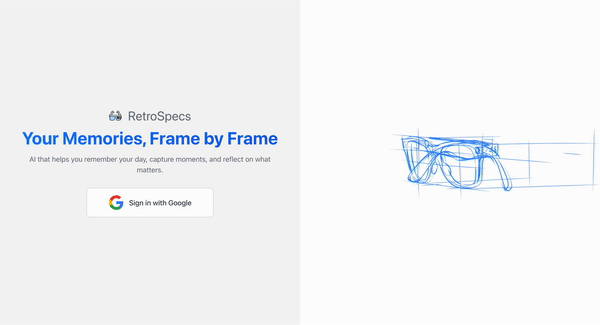

  

# RetroSpecs - your memories, frame by frame
*An AI-powered memory assistant for individuals with Alzheimer's*

*Built for CheeseHacks 2024 🧀*

## Overview

RetroSpecs is a revolutionary smart glasses system that continuously captures your daily activities and allows you to query your experiences through natural language. Designed specifically for individuals with Alzheimer's and their caregivers, RetroSpecs helps maintain independence and peace of mind through AI-powered memory assistance.

## Key Features

- **Continuous Memory Capture**: Seamlessly records your daily activities through a camera
- **Natural Language Queries**: Simply ask questions like "Did I take my medicine today?" or "What did I have for breakfast?"
- **Real-time Assistance**: Provides immediate answers by querying through our website

## Use Cases

- Medication tracking
- Meal monitoring
- Daily routine assistance
- Important conversation recall
- Object location ("Where did I put my keys?")

## Technical Architecture

### Frontend ([GitHub Repo](https://github.com/RetroSpecs-Suite/RetroSpecs-Frontend))
- React.js web application
- Google OAuth authentication
- Image timeline view with infinite scroll
- Natural language search interface
- Past camera feed preview

### Backend ([GitHub Repo](https://github.com/RetroSpecs-Suite/RetroSpecs-Backend))
- Deployed on Raspberry Pi
- Python Flask server
- ChromaDB for vector storage and similarity search
- OpenAI Vision API for image analysis

### Image Processing ([GitHub Repo](https://github.com/RetroSpecs-Suite/RetroSpecs-Backend/tree/main/Raspberry-Pi))
- Raspberry Pi Camera Module
- Python OpenCV for image capture
- Intelligent caching system to filter similar images

## Project Status
This is a proof of concept developed during CheeseHacks 2024. While the core functionality is implemented, additional features and optimizations would be needed for production use.

---

*RetroSpecs: Your memories, frame by frame.*

*Created with ❤️ by [Jerry Luo](https://github.com/jerluo), [Ashwin Talkwalkar](https://github.com/Ashwin-T), [Zaid Ahmed](https://github.com/az8712), and [Rohan Roy](https://github.com/royr0614) for CheeseHacks 2024*
